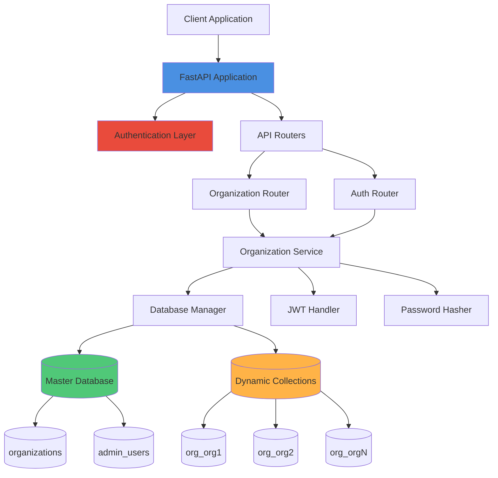

# Architecture Diagram

## System Architecture



## Data Flow

### 1. Organization Creation Flow

```
Client Request
    ↓
POST /org/create
    ↓
Organization Router
    ↓
Organization Service
    ├── Validate organization name (check Master DB)
    ├── Validate email (check Master DB)
    ├── Hash password (bcrypt)
    ├── Create admin user (insert into admin_users)
    ├── Create organization record (insert into organizations)
    └── Create dynamic collection (org_<name>)
    ↓
Response with organization metadata
```

### 2. Authentication Flow

```
Client Request
    ↓
POST /admin/login
    ↓
Auth Router
    ↓
Organization Service
    ├── Find admin by email (Master DB)
    ├── Verify password (bcrypt)
    └── Generate JWT token
    ↓
Response with JWT token
```

### 3. Protected Endpoint Flow

```
Client Request + JWT Token
    ↓
Protected Endpoint (e.g., PUT /org/update)
    ↓
Auth Dependency
    ├── Extract token from header
    ├── Decode and validate JWT
    └── Extract admin_id and organization_name
    ↓
Organization Service
    ├── Verify admin has access to organization
    └── Perform operation
    ↓
Response
```

## Database Schema

### Master Database Collections

#### organizations Collection
```json
{
  "_id": ObjectId,
  "organization_name": "string",
  "org_collection_name": "string",
  "admin_user_id": ObjectId,
  "created_at": ISODate,
  "updated_at": ISODate
}
```

#### admin_users Collection
```json
{
  "_id": ObjectId,
  "email": "string",
  "hashed_password": "string (bcrypt)",
  "organization_name": "string",
  "created_at": ISODate
}
```

### Dynamic Organization Collections

Each organization gets a collection named `org_<sanitized_organization_name>`.

Example: Organization "Acme Corp" → Collection "org_acme_corp"

These collections start empty and can be populated with organization-specific data as needed.

## Component Details

### 1. FastAPI Application (`app/main.py`)
- Entry point of the application
- Configures CORS middleware
- Includes routers
- Manages database connection lifecycle

### 2. Database Manager (`app/database.py`)
- Manages MongoDB connections
- Handles master database operations
- Creates/deletes dynamic collections
- Provides collection data migration utilities

### 3. Organization Service (`app/services/organization_service.py`)
- Contains all business logic for organization operations
- Handles validation
- Manages organization and admin user CRUD operations
- Coordinates database operations

### 4. Authentication Layer (`app/auth/`)
- **JWT Handler**: Creates and validates JWT tokens
- **Password**: Hashes and verifies passwords using bcrypt
- **Dependencies**: FastAPI dependencies for authentication middleware

### 5. Routers (`app/routers/`)
- **Organization Router**: Handles organization CRUD endpoints
- **Auth Router**: Handles authentication endpoints
- Validates requests using Pydantic schemas
- Returns standardized responses

### 6. Models (`app/models/`)
- Data models for Organization and AdminUser
- Handles conversion to/from MongoDB documents

### 7. Schemas (`app/schemas/`)
- Pydantic models for request/response validation
- Ensures type safety and data validation

## Security Architecture

```
┌─────────────────────────────────────┐
│         Client Request               │
└──────────────┬──────────────────────┘
               │
               ▼
┌─────────────────────────────────────┐
│    FastAPI Middleware (CORS)        │
└──────────────┬──────────────────────┘
               │
               ▼
┌─────────────────────────────────────┐
│    Route Handler                    │
└──────────────┬──────────────────────┘
               │
               ▼
┌─────────────────────────────────────┐
│    Auth Dependency (if protected)   │
│    - Extract JWT from header        │
│    - Validate token                 │
│    - Extract user context           │
└──────────────┬──────────────────────┘
               │
               ▼
┌─────────────────────────────────────┐
│    Service Layer                    │
│    - Business logic                 │
│    - Authorization checks           │
└──────────────┬──────────────────────┘
               │
               ▼
┌─────────────────────────────────────┐
│    Database Manager                 │
│    - Secure queries                 │
│    - Connection pooling             │
└──────────────┬──────────────────────┘
               │
               ▼
┌─────────────────────────────────────┐
│         MongoDB                     │
└─────────────────────────────────────┘
```

## Multi-Tenant Isolation

### Current Implementation
- **Collection-level isolation**: Each organization has its own collection
- **Shared database**: All collections in the same MongoDB database
- **Metadata separation**: Organization metadata stored separately in master database

### Isolation Strategy
1. **Data Isolation**: Each organization's data is in a separate collection
2. **Access Control**: JWT tokens contain organization context
3. **Authorization**: Service layer verifies admin has access to requested organization

### Scalability Considerations

**Current Design (Collection-per-Organization)**:
- ✅ Simple to implement
- ✅ Easy to manage
- ✅ Good for small to medium scale
- ⚠️ Limited isolation (same database)
- ⚠️ Potential performance issues with many collections

**Alternative Design (Database-per-Organization)**:
- ✅ Better isolation
- ✅ Easier to scale individual tenants
- ✅ Better backup/restore per tenant
- ⚠️ More complex connection management
- ⚠️ Higher resource usage

## Deployment Architecture

```
┌─────────────────────────────────────────┐
│         Load Balancer                   │
└──────────────┬──────────────────────────┘
               │
       ┌───────┴───────┐
       │               │
┌──────▼──────┐  ┌─────▼──────┐
│  FastAPI    │  │  FastAPI   │
│  Instance 1 │  │  Instance 2│
└──────┬──────┘  └─────┬──────┘
       │               │
       └───────┬───────┘
               │
┌──────────────▼──────────────┐
│    MongoDB Replica Set      │
│  ┌────────┐  ┌────────┐     │
│  │Primary │  │Secondary│     │
│  └────────┘  └────────┘     │
└─────────────────────────────┘
```

## Technology Stack Rationale

### FastAPI
- **Why**: Modern, fast, async Python framework
- **Benefits**: Automatic API documentation, type hints, async support
- **Trade-off**: Newer framework (less ecosystem than Django)

### MongoDB
- **Why**: Flexible schema, easy dynamic collection creation
- **Benefits**: No schema migrations, JSON-like documents
- **Trade-off**: Less ACID guarantees than SQL databases

### Motor (Async MongoDB Driver)
- **Why**: Async/await support for better performance
- **Benefits**: Non-blocking I/O operations
- **Trade-off**: Slightly more complex than synchronous drivers

### JWT Authentication
- **Why**: Stateless, scalable authentication
- **Benefits**: No server-side session storage needed
- **Trade-off**: Harder to revoke tokens (would need blacklist)

### bcrypt Password Hashing
- **Why**: Industry standard, secure, slow (prevents brute force)
- **Benefits**: Built-in salt, proven security
- **Trade-off**: Slightly slower than faster hashing algorithms (by design)

